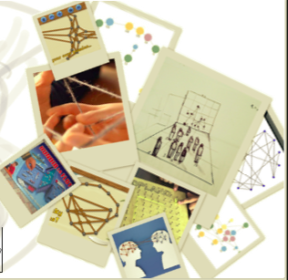

# GeoplanoSocial

Autores
------------
 * Josué Iglesias
 * Elena Sevilla
 
 
Colaboradores
------------
* Guzman Bermejo Rodríguez

Descripción
------------

Proponemos un sencillo juego en el que la interacción entre personas es clave. Las personas que desde la plaza se encuentran observando la pantalla son representadas en ella a modo de nodos (si una persona se mueve, también se mueve el nodo que tiene asociado). De manera aleatoria se generan líneas entre los nodos, creando una especie de maraña (donde nos aseguramos que existan varias líneas que se cruzan). El objetivo del juego será desliar la maraña, es decir, conseguir que las líneas entre nodos no se crucen. Cuando esto ocurra se avisará de ello en la pantalla. Proponemos no explicar las reglas del juego. Las personas que están en la plaza tendrán que interpretar qué papel juegan en esa pantalla para conseguir el objetivo del juego; será necesaria la interacción entre ellos, hablando, moviéndose, etc. Es imprescindible la acción colectiva y la comunicación para lograr desliar la maraña.

